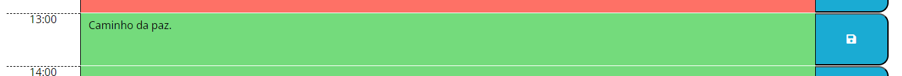

# Daily-Planner-Challenge

## A program that allows the user to record his daily tasks in a dyanmic daily planner.

This project was carried out to create an app that allows the user to record their daily tasks in a dyanmic daily planner. The palanner updates the color of heach time block in accordance with the current time. The planner allows the user to save or erase the entries of each time block by pressing a "save" button.

## Installation

To use this webpage, the user must have access to the internet. Enter, in the search bar, the address "https://antimio.github.io/Daily-Planner-Challenge/" and press Enter.

## Usage

To use the webpage:

1 - Navigate to it and note the elements on the page. At the top there is the title and the current date and time.

2 -The daily planner carries 3 main colours: gray for past time slots, red for the current time slot and green for future time slots.

3 -To save something that they have entered (or a deletion), the user needs to click that slot's corresponding "save" button.

4 - After pressing save, even if the page is refreshed, the entries will be preserved.

## Credits

The EdEx Web Development bootcamp team provided the HTML code and most of the css code. Visit their website at https://skillsforlife.edx.org/enroll/ui/signIn

## License

MIT License

Copyright (c) [2023] [Antimio Luale Da Silva Monteiro Casimiro]

Permission is hereby granted, free of charge, to any person obtaining a copy
of this software and associated documentation files (the "Software"), to deal
in the Software without restriction, including without limitation the rights
to use, copy, modify, merge, publish, distribute, sublicense, and/or sell
copies of the Software, and to permit persons to whom the Software is
furnished to do so, subject to the following conditions:

The above copyright notice and this permission notice shall be included in all
copies or substantial portions of the Software.

THE SOFTWARE IS PROVIDED "AS IS", WITHOUT WARRANTY OF ANY KIND, EXPRESS OR
IMPLIED, INCLUDING BUT NOT LIMITED TO THE WARRANTIES OF MERCHANTABILITY,
FITNESS FOR A PARTICULAR PURPOSE AND NONINFRINGEMENT. IN NO EVENT SHALL THE
AUTHORS OR COPYRIGHT HOLDERS BE LIABLE FOR ANY CLAIM, DAMAGES OR OTHER
LIABILITY, WHETHER IN AN ACTION OF CONTRACT, TORT OR OTHERWISE, ARISING FROM,
OUT OF OR IN CONNECTION WITH THE SOFTWARE OR THE USE OR OTHER DEALINGS IN THE
SOFTWARE.

